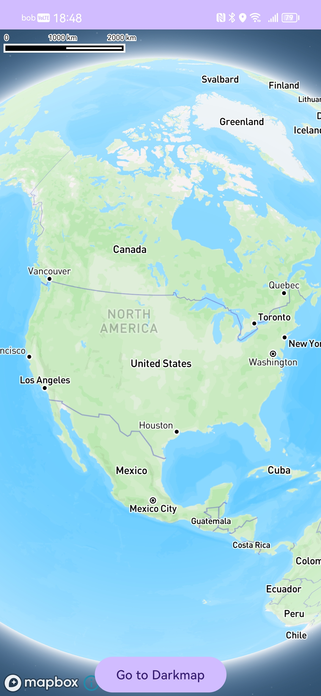
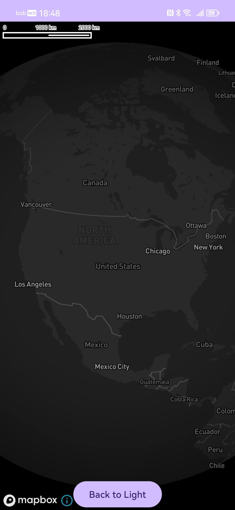
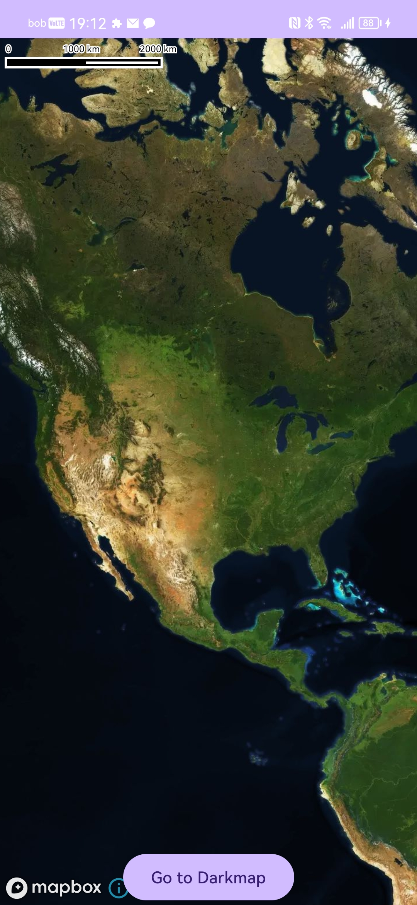
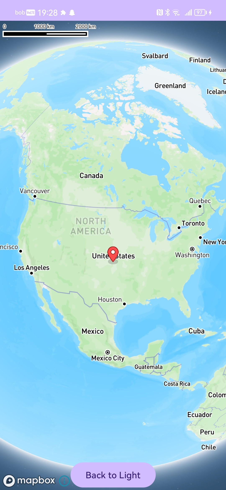
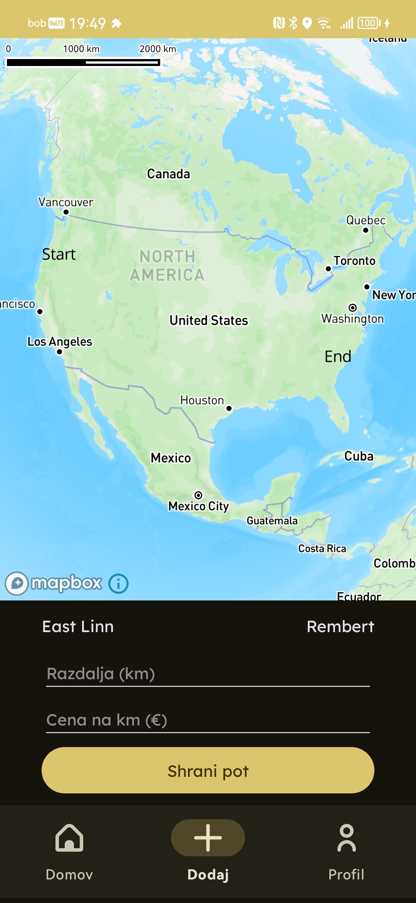

# Mapbox Maps SDK for Android 🗺️

[Mapbox Maps SDK for Android](https://github.com/mapbox/mapbox-maps-android) je napredna knjižnica za integracijo zemljevidov in geolokacijskih funkcij v Android aplikacije. Omogoča ustvarjanje prilagodljivih zemljevidov z interaktivnimi funkcijami, kot so geokodiranje, sledenje GPS-u, 3D vizualizacije in podpora za offline delovanje. Knjižnico sem izbral zaradi njene prilagodljivosti, široke funkcionalnosti in aktivne skupnosti.

## Prednosti ✅

- **Prilagodljivi zemljevidi**: Podpira prilagoditve barv, slojev, ikone in animacije.
- **Napredne funkcije**: 3D vizualizacija, geokodiranje, analitika prometa, sledenje v realnem času.
- **Podpora za več platform**: Enostavna integracija z Android, iOS in spletnimi aplikacijami.
- **Odlično dokumentiran API**: Ponuja bogato dokumentacijo in podporo za razvijalce.

## Slabosti ❌

- Napredne funkcije zahtevajo nekaj znanja in izkušenj.
- Napredne funkcionalnosti, kot so neomejeni zahtevki API ali Mapbox Studio, so plačljive.
- Za delovanje nekaterih funkcij je potrebna aktivna povezava z Mapbox strežniki.

## Licenca 📜

[Mapbox License Agreement](https://www.mapbox.com/legal/tos)

### Je Mapbox brezplačen?

- **Da, za osnovno uporabo**. Mapbox ponuja brezplačen dostop za manjše projekte z omejenimi zahtevki API.
- V večini primerov je zastonj do 25.000 uporabnikov.
- Za komercialno uporabo ali večje projekte se zahteva plačljiva naročnina.

## Število zvezdic, sledilcev, forkov ⭐


## Vzdrževanje projekta 🛠️

- Projekt je **aktivno vzdrževan** z rednimi posodobitvami.
- Zadnja posodobitev: 
- Aktivnost prispevkov: 
- Število razvijalcev: 

## Primer uporabe

### mapbox_access_token.xml
V direktoriju app/res/values je bilo potrebno generirati novo xml datoteko, ki služi kot ključ do Mapboxa.
```xml
<?xml version="1.0" encoding="utf-8"?>
<resources xmlns:tools="http://schemas.android.com/tools">
    <string name="mapbox_access_token" translatable="false" tools:ignore="UnusedResources">pk.YOUR_MAPBOX_ACCESS_TOKEN</string>
</resources>
```
### Dovoljenja
Če se v aplikaciji uporablja lokacija uporabnika je potrebno urediti dovoljenja v Manifest.xml
```xml
<!-- Include this permission to grab user's general location -->
<uses-permission android:name="android.permission.ACCESS_COARSE_LOCATION" />
<!-- Include only if your app benefits from precise location access. -->
<uses-permission android:name="android.permission.ACCESS_FINE_LOCATION" />
```

### Dodajanje knjižnice
Dodajanje Maven repozitorija. V datoteko settings.gradle.kts je potrebno dodati maven repozitorij.
```kotlin
    // Mapbox Maven repository
    maven {
        url = uri("https://api.mapbox.com/downloads/v2/releases/maven")
    }
```
Preveriti je potrebno, da naš projekt uporablja minSdk najmanj 21.
Nato pa še dodamo knjižnico na ravni aplikacije v build.gradle.kts.
```kotlin
    dependencies {
        //...
        implementation("com.mapbox.maps:android:11.9.0")
        //...
    }
```

### Zemljevid v aplikaciji
Po sinhronizaciji projekta lahko dodamo zemljevid v kodo. Najenostavneje, ga je dodati v željen layout.
```xml
<com.mapbox.maps.MapView
    android:id="@+id/mapView"
    android:layout_width="match_parent"
    android:layout_height="match_parent"
    app:mapbox_cameraTargetLat="39.5"
    app:mapbox_cameraTargetLng="-98.0"
    app:mapbox_cameraZoom="2.0"
    app:mapbox_cameraPitch="0.0"
    app:mapbox_cameraBearing="0.0" />
```
V MainActivity.kt do zemljevida dostopamo preko njegovega ID imena in mu lahko nastavimo poljubne nastavitve.
Spodaj mam prikazanih nekaj različnih stilov zemljevidov. Svoj lasten zemljevid pa je mogoče ustvariti v Mapbox Studiu.
```kotlin
mapView = findViewById(R.id.mapView)
mapView.getMapboxMap().loadStyleUri(Style.MAPBOX_STREETS)
mapView.getMapboxMap().loadStyleUri(Style.SATELLITE)
mapView.getMapboxMap().loadStyleUri(Style.DARK)
mapView.getMapboxMap().loadStyleUri(Style.OUTDOORS)
mapView.getMapboxMap().loadStyleUri(Style.TRAFFIC_DAY)
```


Prikaz dodajanja markerja na zemljevid z določeno lokacijo.
```kotlin
mapView = findViewById(R.id.mapView)
mapView.getMapboxMap().loadStyleUri(Style.MAPBOX_STREETS) { style ->
    val annotationApi = mapView.annotations
    val pointAnnotationManager: PointAnnotationManager =
        annotationApi.createPointAnnotationManager()
    val point = Point.fromLngLat(-98.0, 39.5)
    val bitmap = BitmapFactory.decodeResource(resources, R.drawable.red_marker)
    val pointAnnotationOptions = PointAnnotationOptions()
        .withPoint(point)
        .withIconImage(bitmap)
        .withIconSize(0.3)
    pointAnnotationManager.create(pointAnnotationOptions)
}
```


## Primer zemljevida v aplikaciji MileMate
### Opis aplikacije
Aplikacija je namenjena beleženju potnih stroškov v različnih organizacijah ali skupinam. Uporabnik vnese trenutno lokacijo ali pa jo vnese na zemljevidu in končno lokacijo, aplikacija nato izračuna stroške poti po podanih parametrih.


